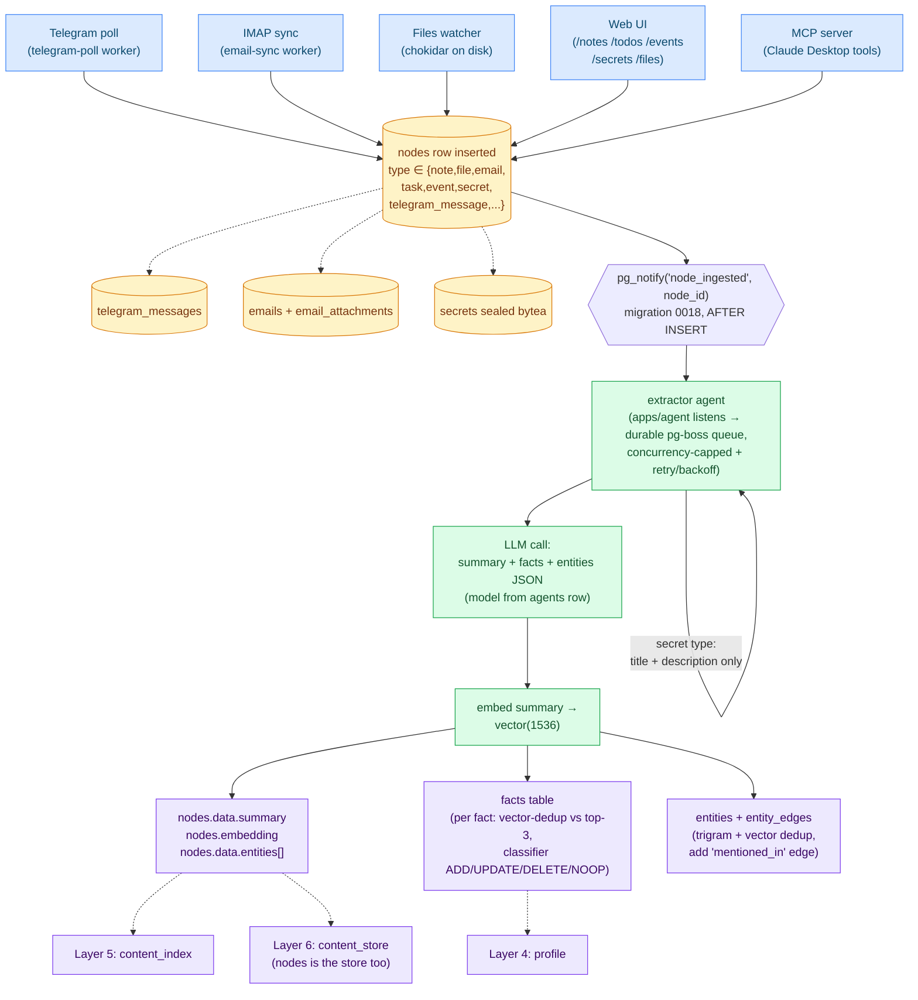
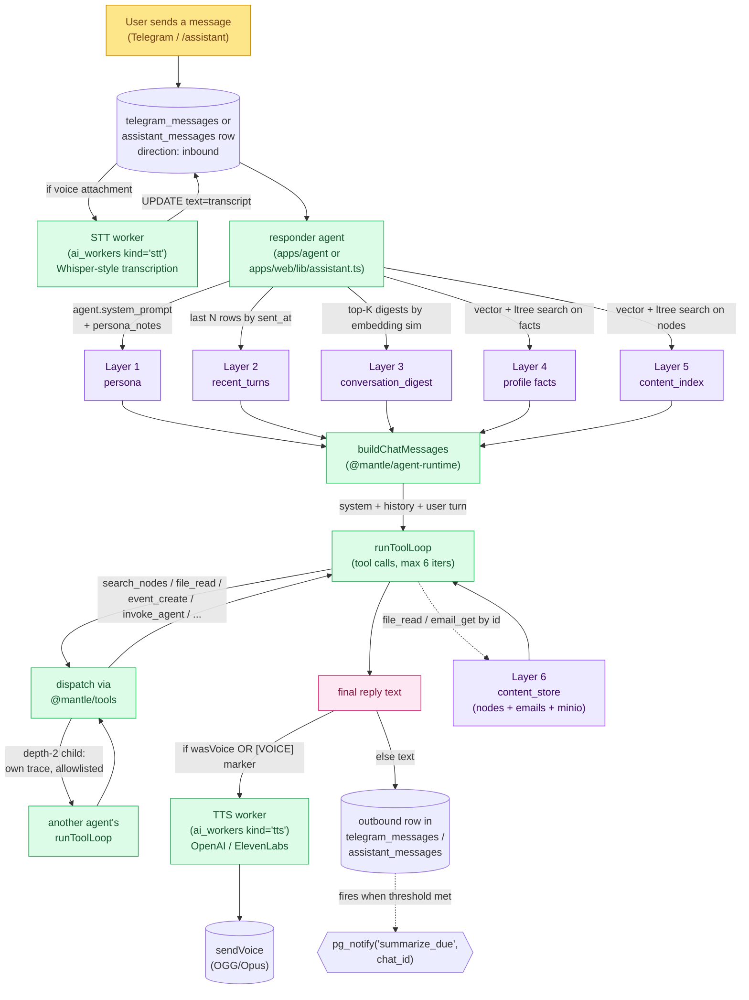

# Mantle Memory Architecture

How Mantle holds and retrieves what it knows. This file is the durable
reference for the memory layer; companion to
[`architecture.md`](./architecture.md) which covers the system as a whole.

Status (2026-05-19): **all six layers live end-to-end.** Every memory
tier in [§2](#2-the-six-layers) has its writer wired, its reader
wired, and tests for the load-bearing pure helpers. Specifically:

| Layer | Writer | Reader | Notes |
|---|---|---|---|
| `persona` | `reflector` (live, with 10m→1h failure backoff) + hand-edits at `/settings/agents` | `responder`, `assistant` | Persona notes append-only; seed prompt editable |
| `recent_turns` | telegram-poll + assistant route | responder, assistant | Live |
| `conversation_digest` | summarizer (live, fires on `summarize_due`) | responder, assistant | Live |
| `profile` (facts) | extractor (live, ADD/UPDATE/DELETE/NOOP classifier) | responder, assistant via vector search | Live |
| `content_index` | extractor (summary + entities + embedding per node) | responder, assistant, MCP `search_nodes` | Live |
| `content_store` | telegram, email, files watcher, web UI, MCP | by-id lookup only | Live for emails, telegram, files, notes, todos, events, secrets |

A seventh capability — **agent delegation** via the `invoke_agent`
builtin — sits beside memory rather than in it: it lets a responder
hand a one-shot prompt to a specialised peer (see [architecture.md
§9b'](./architecture.md#9b-agent-delegation-invoke_agent)).

**Time-windowed recall** is the memory-facing use of that delegation:
where the layers above answer "what do I know about X" by *summary*,
recall replays "what was *actually said*" from the raw message archive
on demand — lossless paging vs. the lossy `conversation_digest`. The
"Remy" agent does it via two builtins (`find_window` locates the window
through digests, `recall_window` pulls the raw turns). See
[`recall.md`](./recall.md).

---

## 0. The flow at a glance

Two diagrams, then the rest of the doc explains the boxes.

### 0.1 The write path — how content becomes memory

When any piece of content arrives (email, voice clip, file edit, web-UI
note, MCP call from Claude Desktop), it lands as a row in `nodes`. A
single Postgres trigger fans the rest out asynchronously, so the
ingester doesn't block on the extractor.



**Key invariants the diagram glosses over:**

- The `secret` type takes a special path. `readNodeBodyRaw` returns
  *only* title + description + tags — the sealed ciphertext in the
  `secrets` table is never read by the extractor. See
  [docs/secrets.md](./secrets.md) for the threat model.
- The `nodes.embedding` write makes the row findable; clearing it (on
  any meaningful edit) reschedules it through the same trigger path
  on next save.
- Fact classification is itself an LLM call per candidate fact —
  bounded by `memory_config.extract_cost_cap_micro_usd` so a hostile
  or malformed document can't burn the budget. Drops are logged
  per-fact.
- The trigger fires on commit, not insert — a rolled-back transaction
  never fires `node_ingested`. This is what makes the dual insert in
  email-sync (node + emails row in one transaction) safe.

### 0.2 The read path — how a user turn assembles memory

When the user sends a message (Telegram or web `/assistant`), the
responder agent reads from every memory layer, then runs the tool
loop. Same code in both surfaces — `@mantle/agent-runtime` is shared.



**The two side processes that don't touch a single user turn:**

- **Summarizer**: when undigested-turn count crosses
  `memory_config.summarize_threshold` (default 30),
  `pg_notify('summarize_due', chat_id)` fires. The summarizer agent
  rolls the oldest N turns into a single `conversation_digest` node
  and marks them digested. Reduces the recent_turns window cost
  without losing the content.
- **Reflector**: every 10 minutes (with exponential backoff on
  failure, capped at 1h), reads new outbound activity since its last
  run and decides whether anything notable about the user surfaced —
  preferences, in-jokes, corrections. Appends to `agent.persona_notes`
  jsonb (which is read on every turn as Layer 1).

Both are *reactive* agents — they're not invoked by the responder, they
react to `pg_notify` and `setInterval` independently. The responder
doesn't know they exist; they don't know the responder exists.

---

## 1. The vision behind the design

Mantle's communication agents (Sarah being the first) are designed as
**continuous-relationship assistants**, not chatbots. There are no
"sessions" the user is aware of. You don't open a thread, ask a question,
close the thread. You speak to Sarah; she remembers everything she's been
told; you pick up wherever you left off.

This frames everything else in this doc:
- **No `session_id`.** The conversation never ends.
- **The agent has identity.** Sarah has a stable persona that grows
  through use, not a per-call system prompt.
- **Memory is the product.** The killer feature is *recall* — Sarah
  surfacing the right note, fact, or email when you mention it vaguely.
- **Same Sarah everywhere.** Telegram, web, voice, future surfaces — one
  identity, one memory, multiple inputs.

The agent's job is to be the front-door — she can delegate to specialist
agents (extractor, summarizer, future planners) when she needs them.

---

## 2. The six layers

Memory in Mantle is six storage layers, each with a fixed role and its
own retrieval pattern. The keyword in the first column is the canonical
identifier used in code, schemas, and config jsonb keys.

| # | Keyword | Display name | What it holds | Lifetime | Always in prompt? |
|---|---|---|---|---|---|
| 1 | `persona` | **Persona** | The agent's stable identity — voice, style, and the relationship notes it has accumulated about *this* user (preferences observed, in-jokes, corrections). | Indefinite; slowly evolves. | Yes — verbatim. |
| 2 | `recent_turns` | **Recent Turns** | The last N raw exchanges between user and agent (`telegram_messages` direction-tagged). | Sliding window (default 20). | Yes — chronological. |
| 3 | `conversation_digest` | **Conversation Digests** | Compressed summaries of older conversations, rolled up in batches by the summarizer agent. | Permanent once written. | Top-K most relevant prepended. |
| 4 | `profile` | **Profile** | Durable, dedup'd facts about the user and their world — identity, relationships, projects, preferences. Each fact is declarative and can be updated, contradicted, or retired. | Indefinite; mutable. | Top-K most relevant retrieved. |
| 5 | `content_index` | **Content Index** | Searchable catalogue over every stored item. Per item: title, tags, 1-2 sentence summary, entities mentioned, embedding. The *spine* of the books — cheap to scan, never the full body. | Refreshed when source content changes. | Top match prepended as link + summary. |
| 6 | `content_store` | **Content Store** | The source content itself — emails, files, notes, sermons, attachments. Append-only, immutable, citable. | Permanent. | Fetched by id only when full body is requested. |

These six layers organise naturally around three concerns:

```
ABOUT THE AGENT       persona               (who I am)

ABOUT OUR DIALOG      recent_turns          (what we just said)
                      conversation_digest   (what we used to say)

ABOUT YOUR WORLD      profile               (what I know is true)
                      content_index         (where the receipts are)
                      content_store         (the receipts themselves)
```

This grouping isn't a 7th layer — it's the mental model behind the six.

### Node types currently in use

`content_store` (Layer 6) is a single `nodes` table polymorphic on
`type`. As of 2026-05 the live writers populate:

| Type | Surface | Specialised table | Extractor body source |
|---|---|---|---|
| `note` | `/notes` | — | `data.content` (markdown) |
| `page` | `/pages` | `pages` (TipTap doc) | `pages.doc_text` (derived plaintext) — see [pages.md](./pages.md) |
| `file` | `/files` | — (bytes on disk under `MANTLE_FILES_ROOT`) | text files inline; `.pdf` via pdf-parse |
| `task` | `/todos` | — | title + status + priority + due_at + body |
| `event` | `/events` | — | title + starts_at + ends_at + location + body (IANA tz preserved for reminder display) |
| `secret` | `/secrets` | `secrets` (sealed bytea) | title + description + tags **only** — sealed payload never reaches the LLM |
| `email` / `email_thread` | inbox / IMAP sync | `emails` + `email_attachments` | subject + bodyText (head+tail truncation at 24K chars) |
| `telegram_message` | Telegram | `telegram_messages` | message text |
| `branch` | folder nodes | — | **never** — `HARD_SKIP_TYPES` |

The enum also declares `sermon`, `contact`, `printer_project` for
future surfaces; none have writers today and they're hidden from the
agent-settings chip picker. The Postgres enum holds them inert.

### Chunked retrieval (`content_chunks`)

Layer 5's per-node embedding is the coarse "spine". For long documents a
single 1536-dim vector is a weak primitive, so the extractor also writes
**section-level chunks** to `content_chunks` (migration 0040): each chunk is a
~1500-char passage with its heading context and its own embedding.
`chunkDocText` (`packages/content/src/chunk.ts`) does the splitting;
`searchChunks` (`packages/search/src/chunks.ts`, surfaced as the MCP
`search_chunks` tool) does cosine search over them. Generalised across all
content (pages, files, emails, …), not pages-specific. **Idempotent**: the
extractor deletes a node's chunks and re-inserts on every (re)extract, so they
never accumulate — the same delete-then-rebuild rule now also applies to
`mentioned_in` edges (previously appended on every run). Full detail +
re-extract semantics in [pages.md](./pages.md) §5–6.

### Fact subtypes (inside `profile`)

The `profile` layer carries facts of three shapes, distinguished by the
`kind` column on `facts`:

- **Factual**: a verifiable claim about a specific thing. *"Sarah's
  passport expires 2030-06-12."* Has a value; can be wrong; can be
  updated.
- **Episodic**: a record of something that happened. *"On 2026-05-17
  Jason said he was preaching Romans 8."* Anchored in time. Doesn't get
  "updated" — superseded by newer episodes.
- **Semantic**: an abstraction inferred from many episodes. *"Jason is a
  pastor."* Stable identity; rarely changes; can be contradicted but
  only by weight of evidence.
- **Preference**: a stable statement about how the user prefers things.
  *"Jason prefers terse replies, no bullet lists."* Drives style.

Each subtype gets different weight at retrieval time. Preferences are
usually always-injected (small, high signal); episodes are
recency-weighted; semantic facts rarely change and stay in the prefix.

### Two shapes of summary

The word "summary" appears in two places and they're different shapes:

- **Item summary** — 1-to-1 with a single Content Store item. Lives as a
  field inside its `content_index` entry (currently planned as
  `nodes.data.summary`). Generated at ingest by the summarizer or
  extractor; refreshed if the source is edited.
- **Aggregate summary** — 1-to-many. One summary covers N source items.
  Conversation digests are the working example. Lives as its own row
  (today a `note` node tagged `conversation-digest`).

Both compress information through an LLM. They differ in cardinality and
home, not in spirit.

### Topic emergence

A single summarizer run can yield **multiple** digests. The summarizer
groups the batch into contiguous topical stretches and emits one digest
per topic, each carrying:

- `data.topic` — a 2-5-word label ("Lister Gantry Rebuild")
- `data.topic_slug` — a slug derived from the label, also added to
  `nodes.tags` as `topic:lister-gantry-rebuild` for `@>` retrieval
- `data.source_turn_count` — turns in this topic, not the whole batch

Each turn's `digestNodeId` points at its topic's digest. The same
topic recurring weeks later produces a new digest with the same slug;
retrieval finds them all via tag match or vector similarity.

Topics are emergent, not declared. They surface on `/debug` as a rolled-up
table (digests × turns × first/last seen) and on individual digest cards.

---

## 3. The retrieval flow

The killer query for Sarah: *"I made a note on my Lister 3D printer
gantry."* Sarah must walk the memory stack from cheapest scan to deepest
fetch and surface the right file. Here's how the layers compose:

```
User: "I have made a note on how I want to build my Lister 3D printer gantry."
                                  │
                                  ▼
                  ┌──────────────────────────────────┐
                  │   Working memory assembly         │
                  │   (per-turn prompt builder)       │
                  └────────────────┬─────────────────┘
                                   │
        ┌──────────────────────────┼──────────────────────────┐
        │ pull always-loaded slices                            │
        ▼                          ▼                          ▼
  ┌─────────┐               ┌──────────────┐         ┌──────────────────┐
  │ persona │               │ recent_turns │         │ conversation_    │
  │         │               │              │         │   digest         │
  │ "I am   │               │ last 20      │         │ "Last month      │
  │  Sarah" │               │  chats"      │         │  Jason mentioned │
  │         │               │              │         │  the 3D printer  │
  │         │               │              │         │  rebuild"        │
  └─────────┘               └──────────────┘         └──────────────────┘
        │                          │                          │
        │ pull relevance-keyed slices                          │
        ▼                          ▼                          ▼
                  ┌──────────────────────────────────┐
                  │           profile                │
                  │  vector + entity search for      │
                  │  facts mentioning "3D printer",  │
                  │  "Lister", "gantry"              │
                  │  → "Jason owns a Lister 3D       │
                  │     printer; project: rebuild    │
                  │     gantry"                      │
                  └────────────────┬─────────────────┘
                                   │
                                   ▼
                  ┌──────────────────────────────────┐
                  │        content_index             │
                  │  multi-step cascade:             │
                  │   ① tag filter   ['note',        │
                  │                   '3d-printing'] │
                  │   ② FTS / embedding rank         │
                  │   ③ read top-3 summaries         │
                  │   ④ pick best match              │
                  │                                  │
                  │  → node 8f3a-… titled            │
                  │   "Lister Gantry Rebuild Plan"   │
                  │   summary: "Linear rail upgrade  │
                  │   for the Lister 3D printer..."  │
                  └────────────────┬─────────────────┘
                                   │
                                   ▼
                   Sarah: "Yes — your note 'Lister
                          Gantry Rebuild Plan' from
                          Apr 12. Want the full plan
                          or just the link?"
                                   │
                  (only if Jason asks for the body, Sarah
                   fetches the content_store row by node.id)
```

The key insight: **Sarah hits the `content_index`, not the
`content_store` directly.** The Index is the spine of the book — title,
tags, summary, embedding. The Store is the body, fetched only when
needed. You don't reread every book on your shelf to remember you own
it; you scan the spines.

Five mini-stages inside the `content_index` cascade:

1. **Tag / FTS pre-filter** (cheap: indexed columns, GIN on tags + tsvector)
2. **Embedding rank** (medium: pgvector cosine similarity)
3. **Read top-K summaries** (very cheap: short text already in the row)
4. **Pick best match**
5. **Fetch the content_store body by id** (only if the user wants the body)

Each step narrows. Cheapest first.

---

## 4. Two retrieval axes: vector and graph

Memory retrieval needs to answer two different *shapes* of question. They
demand different indexing strategies, and a good system uses both.

### 4.1 Vector retrieval — "what's like this?"

A **vector database** stores high-dimensional numeric representations
(*embeddings*) of text. An embedding model converts a piece of text into
a fixed-length array of floats:

```
"Jason is preaching Romans 8 this Sunday"  →  [0.234, -0.018, 0.091, …, 0.412]   (length 1536)
"I'm giving the sermon this weekend"        →  [0.221, -0.030, 0.085, …, 0.398]   (length 1536)
```

Two texts with similar *meaning* produce vectors that are close to each
other in the 1536-dimensional space, even with zero shared words. The
core query a vector DB answers:

> Given this query vector, return the N stored items whose vectors are
> closest (usually by cosine similarity).

**Use cases:** "fuzzy" semantic recall — *"what do I know about church
work?"* hits items that don't say "church" if they're semantically related
(sermon, congregation, pastoral, preaching).

**Examples:** Pinecone, Weaviate, Qdrant, Chroma, Milvus — and, the one
that matters for us, **pgvector**, a Postgres extension that adds a
`vector` column type and similarity operators (`<=>` for cosine,
`<->` for L2).

**Mantle's situation:** pgvector is already loaded
([`infra/postgres/init/01-extensions.sql`](../infra/postgres/init/01-extensions.sql))
and `nodes.embedding` is declared as `vector(1536)`
([`packages/db/src/schema/nodes.ts:45`](../packages/db/src/schema/nodes.ts:45)).
The column is currently always NULL because no ingestion path embeds
content yet. When the extractor lands, every `content_index` entry and
every `facts` row gets embedded at write time and similarity-searched at
read time — same Postgres, no second service.

Typical query shape against `facts`:

```sql
SELECT content, kind, entity_id
FROM facts
WHERE owner_id = $user
ORDER BY embedding <=> $query_embedding   -- cosine distance, lower = closer
LIMIT 10;
```

**Which embedding model produces those vectors matters.** The default is
`openai/text-embedding-3-small` (1536 dims, ~$0.02/1M tokens, solid on
English). Other choices unlock multilingual recall or better quality
at higher cost. See [`docs/embeddings.md`](./embeddings.md) for the
operator-facing decision guide (small vs large vs Gemini vs Cohere
with benchmark numbers + the 1536-dim constraint that shapes the
choice). The runtime mechanics — how the dispatcher resolves the
worker config, how the cache works, how Rebuild Index re-embeds the
whole corpus on a model swap — live in
[`ai-workers.md` §5e](./ai-workers.md#5e-embedding--the-cross-cutting-kind).

### 4.2 Graph retrieval — "what's connected to what?"

A **graph database** stores **entities** (nodes) and the named
**relationships** between them (edges). Two primitives:

- **Entity**: a discrete thing in the world. A Person named Sarah, a
  Place called Cape Town, a Project called "kitchen renovation", an
  Event called "Sunday service 2026-05-17".
- **Edge**: a typed, directional relationship. `MARRIED_TO`, `WORKS_AT`,
  `MENTIONED_IN`, `LOCATED_IN`, `PRECEDED_BY`.

Visually:

```
  (Jason)──MARRIED_TO──▶(Sarah)
     │                     │
     │WORKS_AT             │HAS_PASSPORT──▶(Passport: expires 2030-06-12)
     ▼                     │
  (Church X)               └─BIRTHDAY──▶(June 12)
     │
     PREACHES_AT_ON──▶(Sunday 2026-05-17)──TOPIC──▶(Romans 8)
```

**Use cases:** "precise" relational traversal. *"Who is Sarah related
to?"* — start at Sarah, follow edges. *"What did Jason and Sarah do
together this month?"* — find paths between them, filter by date.
*"When was Sarah's passport last mentioned?"* — start at Sarah, follow
`HAS_PASSPORT`, then `MENTIONED_IN`.

Vector search can't answer these. It returns *similar* things, not
*connected* things. A vector query for "Sarah's passport" might return
items mentioning "Sarah" or items mentioning "passport"; it cannot tell
you they refer to the same object — only an explicit relationship can.

**Examples of graph DBs:** Neo4j, ArangoDB, AWS Neptune, Memgraph,
JanusGraph. Mem0 uses Neo4j when graph features are enabled.

**Mantle does NOT need a separate graph DB.** At personal scale (millions
of edges or less), graphs are just tables — Postgres handles them fine
with foreign keys and **recursive CTEs**. You only need a dedicated graph
engine when traversal becomes the bottleneck of a high-throughput
production system: social graphs, fraud detection, recommendations at
internet scale. None of those apply here.

> **Shipped + confirmed (2026-05).** The graph axis is live: entity↔entity
> relations extracted into `entity_edges`, multi-hop `graph_path` traversal via
> recursive CTE, entity-resolution integrity, and near-dup consolidation. At
> 2,200 edges / 1,365 documents Postgres traverses instantly, and the remaining
> hard problems (entity resolution, verb consistency) turned out to be
> *modelling* problems a graph engine wouldn't solve — so the "no Neo4j" call
> held under real load. Full design: [`knowledge-graph.md`](./knowledge-graph.md).

### 4.3 Why both together

| Query shape | Best tool | Example |
|---|---|---|
| Fuzzy, theme-based | Vector | "What do I know about church work?" |
| Entity-anchored | Graph | "What did Sarah and I discuss this month?" |
| Both | Hybrid | "Recent things related to Sarah about travel" |

The killer pattern is **filter, then rank**: use the graph to restrict
the candidate set ("facts that mention Sarah"), then use vectors to rank
within it ("…by relevance to 'travel plans'"). Or the reverse — vector-
rank first, then expand each result's entity neighbourhood for context.

---

## 5. Layer-to-schema mapping

All in one Postgres. Where each layer lives today, what storage tech
sits behind it, and what's planned:

| Layer | Storage location | Storage tech in play | Status |
|---|---|---|---|
| `persona` | `agents.system_prompt` (seed) + planned `agents.persona_notes` jsonb (or sibling `agent_notes` table if it grows) | **Relational** + **jsonb** | Seed live; evolution unbuilt |
| `recent_turns` | `telegram_messages` rows, direction-tagged. Schema in `packages/db/src/schema/telegram.ts` | **Relational** + **btree** index `(chat_id, sent_at desc)` | ✓ Live |
| `conversation_digest` | `nodes` rows of `type='note'` with `tags @> ['conversation-digest']`. jsonb data carries summary, period, source turn ids | **Relational** + **jsonb** + **FTS** (tsvector) + **pgvector** (planned, for relevance ranking) | ✓ Live (migration 0013) |
| `profile` | `facts` table + `entities` + `entity_edges` for the graph axis (entity↔entity relations, traversed via `graph_path`) | **Relational** + **jsonb** + **pgvector** (every fact embedded) + **Graph** via tables + recursive CTEs (no Neo4j) | ✓ Live — see [`knowledge-graph.md`](./knowledge-graph.md) |
| `content_index` | Columns on existing `nodes`: `title`, `tags`, `data.summary`, `data.entities`, `embedding`, `search_tsv` | **Relational** + **jsonb** + **FTS** (tsvector + GIN) + **pgvector** (IVFFlat) + **ltree** + **GIN** on tags array | Columns exist; population unbuilt |
| `content_store` | Existing `nodes` + specialised tables (`emails`, `email_attachments`, `telegram_messages`, `secrets`, future `files`) + MinIO for attachment bytes | **Relational** + **jsonb** + **ltree** (hierarchical paths) + **S3** (object bytes via MinIO) | ✓ Live |

### 5.1 Storage tech axes — what each one is for

A glossary so the column above reads cleanly:

- **Relational** — plain SQL tables, columns, foreign keys. The default;
  used by every layer for its scaffolding.
- **jsonb** — Postgres native JSON storage with binary representation and
  GIN indexing. Used wherever data is shaped-but-flexible: the type-
  specific payload on `nodes`, agent config, fact metadata, persona
  notes.
- **btree** — standard sorted index. Used for `(chat_id, sent_at)` style
  lookups in `recent_turns` and most "look up by id" queries.
- **FTS (Full-Text Search)** — `tsvector` columns with GIN indexes; the
  `<@`, `@@`, `plainto_tsquery` operators. Cheap keyword retrieval over
  large text. Used by `content_index` and `conversation_digest` for the
  first pass of any text search.
- **pgvector** — `vector(1536)` column type plus cosine / L2 similarity
  operators (`<=>`, `<->`). Indexed by IVFFlat (or HNSW) for fast
  approximate nearest-neighbour search. Used wherever semantic similarity
  matters: `content_index.embedding`, `facts.embedding`,
  `entities.embedding`, planned digest embeddings.
- **Graph** — *not* a separate database. Modeled as `entities` +
  `entity_edges` tables in Postgres, traversed via recursive CTEs.
  Personal scale doesn't justify Neo4j. The graph axis lives inside the
  `profile` layer.
- **ltree** — Postgres extension for hierarchical paths
  (`inbox.email_jason.2026.may`). GiST-indexed. Used on `nodes.path` so
  every layer can answer "everything under this branch" cheaply.
- **S3** (MinIO) — binary bytes only (attachment files). The metadata
  + content-addressed key live in `nodes`; the bytes live in MinIO.

The pattern: **everything that can fit in Postgres lives in Postgres.**
MinIO is the only off-tier dependency, and only because raw file bytes
don't belong in a row.

### The `facts` table sketch (planned 0014)

```sql
CREATE TABLE facts (
  id              uuid PRIMARY KEY,
  owner_id        uuid NOT NULL REFERENCES auth.users(id),
  content         text NOT NULL,           -- the fact as a sentence
  kind            fact_kind NOT NULL,      -- 'factual'|'episodic'|'semantic'|'preference'
  entity_id       uuid REFERENCES entities(id),  -- primary "about" entity, optional
  confidence      real DEFAULT 1.0,        -- 0..1; lower for inferences
  valid_from      timestamptz,             -- when the fact became true
  valid_to        timestamptz,             -- when it stopped (NULL = still current)
  source_node_id  uuid REFERENCES nodes(id) ON DELETE SET NULL,  -- citation
  embedding       vector(1536),
  superseded_by   uuid REFERENCES facts(id),  -- UPDATE replaces a prior fact
  data            jsonb NOT NULL DEFAULT '{}',
  created_at      timestamptz NOT NULL DEFAULT now(),
  updated_at      timestamptz NOT NULL DEFAULT now()
);
```

**Citation is first-class.** Every fact has `source_node_id` pointing
back at the original `content_store` row it was extracted from. This
means:

- You can always trace a fact to its receipt.
- If the source item is edited (e.g. an email re-parsed), derived facts
  can be marked `dirty=true` and re-extracted — much cleaner than
  syncing across two stores.
- If the source is deleted, `ON DELETE SET NULL` makes the fact an
  orphan but doesn't lose it.

### The `entities` + `entity_edges` sketch (planned, after 0014)

```sql
CREATE TABLE entities (
  id          uuid PRIMARY KEY,
  owner_id    uuid NOT NULL REFERENCES auth.users(id),
  kind        text NOT NULL,        -- 'person'|'project'|'place'|'event'|…
  name        text NOT NULL,        -- 'Sarah', 'kitchen renovation'
  aliases     text[] NOT NULL DEFAULT '{}',
  data        jsonb NOT NULL DEFAULT '{}',
  embedding   vector(1536),
  created_at  timestamptz NOT NULL DEFAULT now(),
  updated_at  timestamptz NOT NULL DEFAULT now()
);

CREATE TABLE entity_edges (
  id           uuid PRIMARY KEY,
  owner_id     uuid NOT NULL REFERENCES auth.users(id),
  source_id    uuid NOT NULL,
  source_kind  text NOT NULL,   -- 'entity'|'fact'|'node'
  target_id    uuid NOT NULL,
  target_kind  text NOT NULL,
  relation     text NOT NULL,   -- 'married_to'|'works_at'|'mentioned_in'|…
  data         jsonb NOT NULL DEFAULT '{}',
  valid_from   timestamptz,
  valid_to     timestamptz,
  created_at   timestamptz NOT NULL DEFAULT now()
);
CREATE INDEX entity_edges_source_idx ON entity_edges(source_id, relation);
CREATE INDEX entity_edges_target_idx ON entity_edges(target_id, relation);
```

Temporal edges (`valid_from`, `valid_to`) borrow from Zep's Graphiti
design and let memory reason about facts that change over time.
"Jason worked at X from 2023 to 2025, now works at Y" stays queryable
as "where does Jason work *currently*?" via `WHERE valid_to IS NULL`.

### Entity reconciliation refinements

`reconcileEntity` in [`apps/agent/src/extractor.ts`](../apps/agent/src/extractor.ts)
matches in four steps: (1) exact name/alias, (2) trigram similarity ≥ 0.7,
(3) embedding cosine < threshold, (4) new entity. Steps 2-3 are the merge
paths — they collapse "Mr J Schoeman", "Schoeman", "Don Schoeman", "Jonathan
Schoeman" into one entity, which is great for spelling variations of the
*same person* and disastrous for *different people* who share a surname.

**Same-surname-different-given guard** (added 2026-05-26). When the candidate
is `kind='person'`, the helper `isLikelyDifferentPerson`
([`apps/agent/src/person-names.ts`](../apps/agent/src/person-names.ts)) sits
in front of both merge paths and refuses the merge when **both** names look
like a full given-name + surname pair, share a surname, and have clearly
distinct given names. Conservative — anything ambiguous returns false so the
normal merge still wins:

| Candidate vs existing | Decision |
|---|---|
| `Don Schoeman` vs `Jason Schoeman` | distinct → **new entity** |
| `Don Schoeman` vs `Donald Schoeman` | prefix overlap → merge (nickname/long-form) |
| `Don Schoeman` vs `D. Schoeman` | initial → merge (could be the same) |
| `Don Schoeman` vs `Mr J Schoeman` | title + initial → merge (could be the same) |
| `Don Schoeman` vs `Don Smith` | different surname → not this rule's concern |
| `Don Co` (org) vs `Jason Co` (org) | non-person → not this rule's concern |

Org / place / event reconciliation is untouched. The guard cares about every
known name on the existing entity (primary + aliases): the merge is refused
only if the candidate clashes with **all** of them, so a re-extraction of a
contact already aliased into an entity still finds its way home.

Doesn't unwind earlier collapses — if pre-fix data shows a single
`J. Schoeman` row with five people's aliases, delete the row (facts'
`entity_id` FK is `ON DELETE SET NULL`; `entity_edges` need a manual sweep)
and re-fire `pg_notify('node_ingested')` on the affected source nodes; the
guard does the right thing on the re-extract.

---

## 6. Agents and models that build memory

Every layer is either *populated* (writes happen) or *consulted* (reads
happen) by specific agents or by a small embedding subsystem. The
`agents` table holds the chat-style LLM agents with their model, system
prompt, and API key (already live, configurable at `/settings/agents`).
The embedding subsystem is *not* an agent — it's a stateless utility
called by agents and at retrieval time.

### 6.1 Producers and consumers, layer by layer

| Layer | Who writes it | Who reads it | Cadence |
|---|---|---|---|
| `persona` | `reflector` agent (planned) appends notes; the seed `system_prompt` is hand-written or edited via `/settings/agents` | `responder` (every turn) | Reflector: periodic / on signal. Seed: rarely. |
| `recent_turns` | The ingestion path (telegram-poll worker writes inbound; `responder` writes outbound) | `responder` (every turn); `summarizer` (when rolling up) | Continuous |
| `conversation_digest` | `summarizer` agent | `responder` (top-K most relevant prepended each turn) | When undigested-turn count crosses threshold (default 30) |
| `profile` (`facts` table) | `extractor` agent | `responder` (top-K relevant prepended each turn); MCP `search` tool for external clients | On every new `content_store` row; on edits via `dirty=true` flag |
| `content_index` (fields on `nodes`) | `extractor` agent (or a dedicated `indexer` role — for v1 the extractor produces both summary and facts in one pass) | `responder` (when user mentions content); MCP `search` tool | On every new `content_store` row |
| `content_store` | Ingestion workers (email-sync, telegram-poll, future file/note ingest) | Fetched by id only when full body is needed | Append-only on ingest |

### 6.2 The agent roles and worker kinds

Memory is built by two distinct populations of LLM-driven things —
they live in two tables now, after the `0027_ai_workers.sql` split:

**Conversational agents** (table: `agents`, UI: `/settings/agents`,
enum: `agent_role`). These reason, take turns, have persona notes,
memory, and tool loops:

| Role | Status | Default model | What it does |
|---|---|---|---|
| `responder` | ✓ Live | `anthropic/claude-sonnet-4.6` | The user-facing chat agent (Saskia for Telegram). Reads from every layer, composes replies. Heavy reasoning. Supports voice in/out via the TTS/STT workers below. |
| `assistant` | ✓ Live | `anthropic/claude-sonnet-4.6` | The web-chat counterpart at `/assistant`. Same code path as `responder` via `@mantle/agent-runtime`; same memory, different transport. Falls back to `responder` if no `assistant` row exists. |
| `custom` | ✓ Live | Whatever you pick | Catch-all for anything else, e.g. `invoke_agent` delegation targets (specialists Saskia hands off to). |

**One-shot AI workers** (table: `ai_workers`, UI: `/settings/ai-workers`,
enum: `ai_worker_kind`). These don't have personalities — they do one
job per invocation, triggered by system events:

| Kind | Status | Default | What it does |
|---|---|---|---|
| `summarizer` | ✓ Live | `anthropic/claude-haiku-4.5` (via OpenRouter) | Produces `conversation_digest` rows. Cheap, runs on a debounced LISTEN. |
| `extractor` | ✓ Live | `anthropic/claude-haiku-4.5` (via OpenRouter) | At content ingest: writes per-item summary + entities into `content_index`, extracts facts + runs the ADD/UPDATE/DELETE classifier into `profile`. Per-node-type body resolution in `readNodeBodyRaw` (markdown, PDFs via pdf-parse, email subject+body, structured task/event metadata, secret metadata-only). |
| `reflector` | ✓ Live | `anthropic/claude-haiku-4.5` (via OpenRouter) | Reads new outbound activity (Telegram + web `/assistant`) every 10 min; appends to the responder's `persona_notes` when something notable surfaces. Never overwrites the seed `system_prompt`. |
| `tts` | ✓ Live | OpenAI `gpt-4o-mini-tts`, voice `nova` | Synthesises voice replies. Triggered when the user voice-messaged us OR the LLM emitted a `[VOICE]` marker. Adapter-driven; OpenAI + ElevenLabs wired. |
| `stt` | ✓ Live | OpenAI `whisper-1` | Transcribes inbound Telegram voice notes before the responder sees anything. Adapter-driven; OpenAI wired today. |
| `vision` | (defined, not wired) | — | Image → text. Whiteboards / receipts / document scans, when wired. |
| `image_gen` | (defined, not wired) | — | Text → image. Reserved for tool-call use by Saskia. |

**Why Sonnet for `responder` / `assistant`:** these agents do real
reasoning across all six memory layers in the same prompt. Cheaping out
here is the wrong tradeoff — recall quality lives or dies by the
responder's ability to use what's been retrieved.

**Why Haiku for the background agents:** summarization, extraction, and
reflection are well-defined compression tasks. Haiku is 5-10x cheaper
than Sonnet and plenty smart for them. Could go further (DeepSeek,
local Qwen) for cost; we default to Haiku for stability + caching.

**Priority ranking** (the `priority` column on `agents`) decides who
wins when two agents share a role — e.g. two `responder` rows enabled
means the higher-priority one handles Telegram. Drop a row's priority
to switch. See `architecture.md` §9b for the resolution logic.

**Delegation between agents** is opt-in via the `invoke_agent` builtin
tool. Each agent's `memory_config.delegate_to: string[]` lists which
peer slugs it may invoke; empty/missing = no delegation (fail closed).
The child runs one-shot with its own persona + tools + API key — the
parent's conversation history is NOT forwarded. Chain depth is capped
at 2 (parent → child, no grandchildren) and self-invocation is refused
even when the parent's own slug is in the list. Cost is attributed to
the child agent's trace independently — `/debug` "spend by agent" stays
correct. Full design: [architecture.md §9b'](./architecture.md#9b-agent-delegation-invoke_agent).

### 6.3 The embedding subsystem

Embedding text into vectors is its own concern, separate from the chat
agents. Different model type, different endpoint, different scale.

- **What it does.** Given a piece of text, returns a `vector(1536)`
  that can be similarity-searched in pgvector. No reasoning, no system
  prompt, no streaming. Pure transform.
- **Default model.** `openai/text-embedding-3-small`. 1536 dimensions
  (matches our column). $0.02 per 1M tokens. Fast and cheap enough that
  embedding everything we write is unmeasurable on the bill.
- **API path.** OpenRouter now routes embedding requests — same key, same
  base URL, just a different endpoint:
  `POST https://openrouter.ai/api/v1/embeddings` with body
  `{ model: 'openai/text-embedding-3-small', input: 'text…' }`.
  This means the **existing `openrouter` API key in `/settings/keys`
  covers both chat and embeddings** — no separate OpenAI key required.
- **Alternatives routed via OpenRouter** (live as of 2026-05):

  | Model | Dims | $/1M tokens | Notes |
  |---|---|---|---|
  | `openai/text-embedding-3-small` | 1536 | $0.020 | Default. Matches column. |
  | `openai/text-embedding-3-large` | 3072 (truncatable) | $0.130 | Slight retrieval gain. |
  | `google/gemini-embedding-001` | 256/768/1536/3072 (configurable) | $0.150 | Set output dim to 1536 to match our column. |
  | `google/gemini-embedding-2-preview` | configurable | $0.200 | **Multimodal** — text/image/file/audio/video. Worth keeping in pocket for when content_store ingests PDFs/photos. |
  | `qwen/qwen3-embedding-8b` | 4096 | $0.010 | Cheap, but schema change. |
  | `perplexity/pplx-embed-v1-0.6b` | 1024 | $0.004 | Cheapest paid; schema change. |
  | `nvidia/llama-nemotron-embed-vl-1b-v2` | (varies) | **free** | Multimodal; useful for one-off backfills. |
  | Local `all-MiniLM-L6-v2` (sentence-transformers in a Docker sidecar) | 384 | $0 (your VPS CPU) | Schema change; another moving part; becomes attractive only at scale. |

  Switching dimensions later is a migration (new column, backfill,
  cutover) — not impossible, but a deliberate move. `text-embedding-3-small`
  at 1536 is the safest commitment.

- **Switching models (same 1536 dims).** Vectors from different models
  live in different spaces — comparing across them returns garbage
  distances. To switch cleanly:
  1. Update `MANTLE_EMBEDDING_MODEL` or the per-agent
     `memoryConfig.embedding_model` to the new slug.
  2. Run `pnpm re-embed --model=<new-slug>` to re-vectorise every
     stored embedding (`nodes`, `facts`, `entities`) using the new
     model. Reuses the cached summary + fact + entity text — skips
     the chat-model extraction entirely; only pays the embedding API.
  3. Use `--dry-run` first to see row count + cost estimate.
  Idempotent: re-running with the same model hits the embedding_cache
  for every row and is free.

- **Where it's called.**
  - **At write time** by the `extractor` (per content_store item +
    per fact), by the `summarizer` (per digest, for relevance ranking),
    and by the entity ingest path (per entity).
  - **At read time** by the responder (to embed the user's incoming
    message + any sub-queries it forms before doing similarity search
    against `facts`, `content_index`, or entities).
- **Caching.** Embeddings are deterministic for a given (model, text)
  pair. Cache by content hash to avoid re-embedding identical strings.
  Free win once volume rises.
- **Where it lives in code.** [`packages/embeddings/src/index.ts`](../packages/embeddings/src/index.ts)
  exposes `embed(text)` and `embedBatch(texts)` for the text path, plus
  `embedMultimodal(inputs)` accepting a mixed array of
  `{ type: 'text' | 'image' | 'audio' | 'file', … }` items. Reads the
  OpenRouter key from the vault via `getApiKey(userId, 'openrouter')`.
  Cache key is `sha256(model || ':' || canonical(input))`, so identical
  strings *and* identical image URLs collapse to one row.
- **Switching models.** Set `MANTLE_EMBEDDING_MODEL` in `.env.local` to
  globally swap the default (e.g. `google/gemini-embedding-2-preview`),
  or pass `opts.model` per call. The package whitelists multimodal
  models via `MULTIMODAL_MODELS` — passing an image/audio/file input
  to a text-only model throws with a clear message. Gemini's
  `output_dimensionality` is wired to 1536 so the response always fits
  the pgvector column without a schema change.

- **One model, configured in N+1 places — keep them equal.** A common
  question: *why is the embedding model set on the agent (Saskia) and not
  on an ai_worker?* The answer is that it's on **both**, because there are
  two distinct `embed()` call sites:
  - **Write side** — the `extractor` ai_worker embeds stored content
    (`nodes`/`facts`/`entities`/`content_chunks`). Configured via
    `ai_workers.params.embedding_model` (`apps/agent/src/extractor.ts`).
  - **Read side** — the responder (Saskia) and web assistant embed the
    *incoming user message* to do similarity search at query time.
    Configured via `agents.memory_config.embedding_model`
    (`apps/agent/src/main.ts`, `apps/web/lib/assistant.ts`). It lives on
    the agent because the agent is what does the retrieving.

  So it's **not** "on the agent instead of the worker" — it's one model
  per call site. And it is a **brain-wide invariant, not a per-component
  preference**: the writer and *every* reader (responder, assistant, and
  any future agent that does vector retrieval) must use the **same** model,
  or query vectors and stored vectors fall in incompatible spaces and
  similarity search silently returns garbage. The 1536-dim `vector` column
  additionally locks the dimension.

  `MANTLE_EMBEDDING_MODEL` (env) is the single source of truth that keeps
  every side aligned by default; the per-row `embedding_model` fields are
  *overrides* that all fall back to it. **Today every override is null and
  the env is unset, so the whole system uses `openai/text-embedding-3-small`
  uniformly — write and read are aligned.**

  This is correct but fragile: nothing enforces that the N+1 overrides
  agree. We **deliberately keep** the per-row overrides (reviewed
  2026-05-23) rather than collapsing to a single global knob — leaving room
  for a future second corpus — but the operating discipline is: **switch the
  embedding model via `MANTLE_EMBEDDING_MODEL` (or change every row at once)
  and then run `pnpm re-embed`. Never set it on one agent alone**, or you
  split the brain's vector space.

### 6.4 The agent → layer dataflow

Visual map of who writes what, who reads what:

```
                              ┌─────────────────┐
                              │   responder     │ (Sonnet)
                              │   (user-facing) │
                              │                 │
                              │  READS:         │
                              │   persona       │
                              │   profile       │◀──── reads top-K facts
                              │   conv_digest   │◀──── reads top-K digests
                              │   content_index │◀──── reads top hit (if relevant)
                              │   recent_turns  │◀──── reads sliding window
                              │                 │
                              │  WRITES:        │
                              │   recent_turns  │ (outbound rows)
                              └─────────────────┘
                                       ▲
                                       │ delegates / shares store
                                       │
       ┌───────────────────────────────┼────────────────────────────────┐
       │                               │                                │
┌──────┴──────────┐         ┌──────────┴───────┐         ┌──────────────┴─────┐
│   summarizer    │         │   extractor      │         │   reflector        │
│   (Haiku)       │         │   (Haiku, plan.) │         │   (Haiku, planned) │
│                 │         │                  │         │                    │
│  READS:         │         │  READS:          │         │  READS:            │
│   recent_turns  │         │   content_store  │         │   recent_turns     │
│                 │         │   facts (for     │         │   conv_digest      │
│  WRITES:        │         │     dedup check) │         │                    │
│   conv_digest   │         │                  │         │  WRITES:           │
│                 │         │  WRITES:         │         │   persona_notes    │
└────────┬────────┘         │   content_index  │         └──────────┬─────────┘
         │                  │   facts (profile)│                    │
         │ uses             │                  │                    │
         │                  └────────┬─────────┘                    │
         │                           │ uses                         │
         ▼                           ▼                              │
                  ┌──────────────────────────────────┐              │
                  │   embedding subsystem            │              │
                  │   (openai/text-embedding-3-small)│              │
                  │   utility, not an agent          │              │
                  │   called from anywhere that      │              │
                  │   needs a vector(1536)           │              │
                  └──────────────────────────────────┘              │
                                                                    │
                                                                    │
                              ┌─────────────────┐                   │
                              │   ingestion     │                   │
                              │   workers       │                   │
                              │   (email-sync,  │                   │
                              │    telegram-poll│                   │
                              │    etc.)        │                   │
                              │                 │                   │
                              │  WRITES:        │                   │
                              │   content_store │ ───triggers──▶ extractor
                              │   recent_turns  │ ───triggers──▶ summarizer (eventually)
                              │                 │                   │
                              └─────────────────┘                   │
                                                                    │
                              ┌─────────────────────────────────────┘
                              │
                              ▼
                              (reflector consumes the same conversation
                               stream the responder produces, in slow
                               background passes)
```

---

## 7. The retrieval order in the prompt

Once the full memory stack is built, the responder's prompt assembly is:

```
[persona]                                     ← cache_control (stable for days)
[profile — top-K facts]                       ← cache_control (stable for minutes)
[conversation_digest — last N digests]        ← cache_control (changes every ~20 turns)
[content_index hits — if user mentioned content]  ← changes per turn
[recent_turns — last N raw]                   ← drifts each turn
[new user message]                            ← always fresh
```

Persona first, then world-knowledge facts (load-bearing identity context),
then dialog memory, then per-query content references, then raw recent
turns. The model treats the early blocks as durable and the late blocks
as live conversation.

Three Anthropic cache breakpoints used (of four allowed). One slot stays
free for a future "stable history prefix" breakpoint if the raw-turn
section starts dominating the bill.

---

## 8. Build sequence

Each step delivers value standalone.

1. **`recent_turns`** — DONE (migration 0012, agent runner).
2. **`conversation_digest`** — DONE (migration 0013, summarizer agent).
3. **`packages/embeddings` + embedding_cache** — DONE (migration 0014).
   Shared `embed()`/`embedBatch()` via OpenRouter; content-hash cache
   makes re-embedding identical strings free.
4. **`facts` table + extractor agent (content_index + profile)** — DONE
   (migrations 0015/0016/0017/0018). Extractor runs on
   `pg_notify('node_ingested')`, writes summary + embedding to
   `nodes.data` / `nodes.embedding`, runs the ADD/UPDATE/DELETE
   classifier against existing facts, reconciles entity mentions to
   `entities` + adds `mentioned_in` edges. Configured via
   `memory_config.extract_types` (default `['note']`).
5. **Responder retrieves the full stack** — DONE. Embeds the inbound
   message once, vector-searches facts + content_index, prepends them
   with three Anthropic cache breakpoints (persona+facts / digests /
   content hits + turns).
6. **`persona` evolution** — DONE. Reflector agent runs every 10 min,
   appends to `agents.persona_notes` when it spots a style preference,
   relationship signal, or correction in recent dialog. Capped at 100
   notes per agent (oldest aged out FIFO).
7. **`entities` + graph traversal API** — DONE. `packages/search` exposes
   `searchEntities`, `entityNeighbors`, `entityFacts`, `entityMentions`;
   four matching MCP tools (`entity_search`, `entity_neighbors`,
   `entity_facts`, `entity_mentions`) ship the graph axis to Claude.
   Single-hop only for now — recursive CTE multi-hop walker waits until
   a query actually demands it.
8. **Web assistant surface** — DONE (MVP). `/assistant` page + `POST
   /api/assistant/turn` route; new `assistant_messages` table (migration
   0021); shared `packages/agent-runtime` exports `buildChatMessages` +
   `captureLlmUsage` for both surfaces. Memory layers wired: persona +
   facts + content_index + recent assistant turns. Deferred: streaming
   (request/response for now) and conversation digests for the web (kicks
   in later once volume warrants).

Roughly a weekend per remaining step.

---

## 9. What we deliberately don't do

- **No separate vector DB.** pgvector in one Postgres handles personal-
  scale data with room to spare. Pinecone et al. are right when you
  shard billions of vectors across regions; not us.
- **No separate graph DB.** Neo4j is right when traversal is the
  application's bottleneck. For one user's life, recursive CTEs on a few
  thousand edges are fast and free.
- **No Mem0 / Letta / Zep as infrastructure.** We borrow the *patterns*
  (taxonomy, retrieval ordering, ADD/UPDATE/DELETE classifier, temporal
  edges) and implement them inside Mantle's Postgres. One store, one
  operational story, full ownership of every prompt and every schema.
  See [`architecture.md`](./architecture.md) for the broader reasoning.
- **No automated background fact mining of all historical content from
  day one.** The extractor runs on new ingest, not on a sweep of
  history. A one-off backfill script can replay older content into the
  memory layer once the pipeline is stable.
- **No user-visible sessions.** Sarah is continuous. Internally we may
  cluster turns into topics; the user never declares one.

---

## 10. Reading the code

Live today, in order of first read:

1. [`packages/db/src/schema/facts.ts`](../packages/db/src/schema/facts.ts) —
   shape of a fact (factual / episodic / semantic / preference).
2. [`packages/db/src/schema/entities.ts`](../packages/db/src/schema/entities.ts)
   + [`entity-edges.ts`](../packages/db/src/schema/entity-edges.ts) —
   the graph axis.
3. [`packages/embeddings/src/index.ts`](../packages/embeddings/src/index.ts) —
   shared `embed`/`embedBatch` via OpenRouter, with hash-keyed cache.
4. [`apps/agent/src/extractor.ts`](../apps/agent/src/extractor.ts) —
   per-item summary + embedding + facts + entity reconciliation. The
   ADD/UPDATE/DELETE/NOOP classifier prompt lives in here.
5. [`apps/agent/src/main.ts`](../apps/agent/src/main.ts) `loadContext()` —
   how persona / facts / digests / content_hits / turns get assembled
   into the responder's prompt.
6. [`apps/agent/src/messages.ts`](../apps/agent/src/messages.ts) —
   `buildChatMessages` with three Anthropic cache breakpoints.
7. [`apps/agent/src/summarizer.ts`](../apps/agent/src/summarizer.ts) —
   `conversation_digest` production from `recent_turns`.
8. [`apps/agent/src/reflector.ts`](../apps/agent/src/reflector.ts) —
   persona_notes evolution from dialog signals.
9. [`apps/web/scripts/extract-backfill.ts`](../apps/web/scripts/extract-backfill.ts) —
   re-fires `node_ingested` for existing nodes missing summary/embedding.

The full lookup at `/debug` shows recent digests, facts, content_index
coverage, persona_notes, Telegram chat state, and agent activity in
one server-rendered page.
